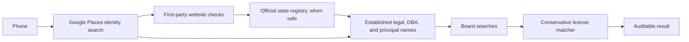

# HireNimbus License Discovery Agent

Given a U.S. business phone number, this project looks for a business identity
and relevant contractor or trade licenses. It records its evidence and source
limits so a reviewer can see why each candidate was accepted, rejected, or left
unresolved. The operating rule is: **acquire broadly, accept conservatively**.

## What the pipeline does



1. Normalize and validate the phone, then ask Google Places for candidates and
   details. A Places result is a hypothesis until its identity is supported.
2. Check the first-party website's homepage and a bounded set of identity routes
   for phone, name, address, legal-name, and board-specific license-number
   evidence. The crawl is limited to eight same-domain pages.
3. Query a relevant official registry where a safe public path exists. Only an
   established entity can add registry-backed legal names, DBAs, or qualifying
   principals to the shared SearchKeys.
4. Send those keys to selected official licensing boards. Board rows are
   candidates; the final matcher checks identity, jurisdiction, trade, and
   contradictions before acceptance.

Registry evidence keeps its source, entity ID, original name, and role. Fuzzy
similarity by itself cannot establish an entity or accept a license. Partial
and fuzzy board-name matches remain near-misses. A blocked or empty query is
reported as incomplete or not-found for that query; it is not evidence that a
business is unlicensed.

## Setup

Python 3.12 or newer is required.

```bash
python -m venv .venv
source .venv/bin/activate
python -m pip install -e '.[dev]'
cp .env.example .env
```

Enable Google Places API (New) in Google Cloud and add a restricted key to
`.env`:

```dotenv
GOOGLE_PLACES_API_KEY=your-restricted-api-key
```

`.env` and runtime caches are ignored by Git. The CLI resolves the `.env` file
from the current directory. You can set `HIRENIMBUS_CACHE_PATH` to change the
default `.cache/license_results.json` cache path.

## Run it

Resolve the identity only:

```bash
lookup_identity "(512) 943-7070"
```

Run the full pipeline from Python:

```python
from app import find_licenses

result = find_licenses("(512) 943-7070")
print(result.model_dump_json(indent=2))
```

`find_licenses(phone, refresh=True)` makes a new attempt and returns that
attempt for review. A partial or failed refresh does not replace a previously
stored complete Phase 2 result.

### Cache keys

Without a market hint, Phase 2 uses `phase2:<normalized E.164 phone>`. With a
market hint, it uses
`phase2:expanded:<normalized E.164 phone>:<trimmed, case-folded market hint>`.
The hint helps choose likely jurisdictions; it does not establish identity or
license ownership.

## Registry evidence and conservative matching

An established entity can add three kinds of names to board search:

- the registry's legal name;
- a current official DBA, trade name, or fictitious name;
- a person explicitly identified by the registry as a qualifying principal.

The base Places name remains separately labeled. Registered agents, organizers,
signers, and service agents are not principal keys. Multiple unresolved
registry candidates remain ambiguous. Exact normalized names and qualifying
official aliases may establish an entity under the documented policy; fuzzy
similarity alone, a registered-agent address, or a shared city does not.

Final matching also checks board jurisdiction and trade compatibility, exact
identity evidence, and material conflicts. The 0.88 fuzzy threshold is retained
for near-miss reporting; fuzzy similarity alone never accepts a license. An
exact first-party published license number can support a separate, narrow
board-specific bridge only when the verified first-party evidence and official
board return the same canonical number and the remaining safeguards pass.
Different-name person or master-license records still need an established
principal relationship or another existing person-specific rule.

## State-source limits

| State / source | What the current integration can do | Main limit |
|---|---|---|
| Virginia SCC and DPOR | Parse a legitimately available SCC detail record; search DPOR official regulant lists. | SCC live name search requires reCAPTCHA and stops there. Detail parsing is not a general manual-ID importer. DPOR downloads can be malformed or unavailable. See [Virginia evidence workflow](docs/virginia_manual_registry_evidence.md). |
| Maryland SDAT and Labor boards | Preserve registry-derived SearchKeys into the Maryland board-search audit. | SDAT search/detail submission is protected by Turnstile. Electrician and MHIC board forms require human verification. The code performs a safe form check, records keys, and does not submit names or bypass CAPTCHA. The Maryland deterministic example proves the handoff, not a completed live name query. See [Maryland evidence workflow](docs/maryland_manual_registry_evidence.md). |
| District of Columbia DLCP and Industrial Trades | Join official corporate, trade-name, and beneficial-owner records by exact file number; search supported plumbing, electrical, and HVAC/refrigeration license categories. | Other DC categories are unsupported. Beneficial-owner records are last-reported and do not prove the relationship is current. |
| California SOS and CSLB | Probe ordinary public SOS access and accept explicit manual evidence; use official CSLB public license data for board candidates. | No documented unauthenticated automated SOS name-search contract is available; blocked/unavailable sources remain incomplete. County fictitious-business-name filings are out of scope. CSLB's free master file does not cover every historical or inactive record. |
| Texas TDLR and TSBPE | Continue using the existing official board integrations; bounded retrieval improvements include exact-number lookups where supported. | No Texas registry enrichment was added. TSBPE downloads can return HTTP 403. Texas licenses are still included in the expanded reference set. |

No integration bypasses CAPTCHA, Turnstile, WAF, authentication, or other
access controls. Google Places provider lookups completed without provider
errors for all 22 valid rows in the current run; that does **not** mean all
business identities resolved. Identity resolution still requires corroborating
evidence.

## Evaluation

The expanded evaluation uses a **23-license frozen manually adjudicated
reference set**. All 17 unique valid phone cases were manually investigated.
Official board and license records were primary evidence; registry, DBA,
principal, address, phone, and first-party website evidence supported the
business-to-license relationship. Fuzzy similarity alone was not sufficient.
Licenses shared across phones are globally deduplicated and retain multiple
`case_ids`.

The original eight-license set was only the conservative verified subset
available during the initial evaluation. The expanded frozen set contains 23
licenses: 10 Texas and 13 from Maryland, DC, Virginia, and California. Texas
registry expansion was out of scope, but Texas board licenses remain in the
denominator.

The frozen evaluation input is
[`data/evaluation_ground_truth_expanded.json`](data/evaluation_ground_truth_expanded.json).
Production code does not read it. The source audit is in
[`evaluation/expanded_ground_truth_sources.md`](evaluation/expanded_ground_truth_sources.md);
it identifies which frozen entries still lack retained primary evidence.
Primary evidence is retained in the repository for 16 of the 23 frozen
references. Seven historical/manual references could not be independently
reproduced during the final audit because of current source-access limitations
or missing retained relationship evidence. They remain frozen so the manually
adjudicated evaluation is not retroactively changed; they are not described as
currently independently verified.

To run the expanded evaluation, use a fresh cache and write the output outside
the historical report paths. This performs live provider, registry, and board
lookups; blocked or empty public sources remain incomplete. It does not
overwrite the current or historical reports:

```bash
eval_dir="$(mktemp -d "${TMPDIR:-/tmp}/hirenimbus-expanded.XXXXXX")"
PYTHONPATH=src python scripts/evaluate.py \
  --ground-truth data/evaluation_ground_truth_expanded.json \
  --cache-path "$eval_dir/cache.json" \
  --output "$eval_dir/report.json"
```

The current comparable report is
[`evaluation/expanded_evaluation_report.json`](evaluation/expanded_evaluation_report.json).
Measured against the frozen manually adjudicated reference set, its result is
**11 / 23 (47.8% recall)**, **100% judgeable license precision (11/11)**, zero
verified incorrect predictions, and one unverified out-of-set prediction:
`DC_INDUSTRIAL_TRADES:ECC40000316`. Registry attribution is two legal-name
recoveries, zero DBA/trade-name recoveries, and zero principal recoveries.

P05 is the clearest registry-expansion success: the Places marketing name led
to an official DC legal entity; its registry-derived legal-name key reached
the Board of Industrial Trades; and three licenses were accepted. Two of those
three are counted as legal-name-attributed recoveries; the third matched the
base business name.

P16 recovered CSLB `806952` after the verified first-party San Francisco page
published that exact number and the official CSLB data independently returned
it. The accepted license is separate from the evaluator's identity-label
check: the predicted Places label does not match the frozen `Roto-Rooter San
Francisco` name, so P16's identity label remains incorrect.

The Phase 1 report and initial Phase 2 report retain their historical 1 / 8
results. The initial Phase 2 files are preserved follow-up snapshots. Phase 1
is the tracked
[`evaluation/day3_evaluation_report.json`](evaluation/day3_evaluation_report.json).
The initial Phase 2 report and its explanation are preserved as
[`evaluation/phase2_evaluation_report.json`](evaluation/phase2_evaluation_report.json)
and [`evaluation/phase2_evaluation_audit.md`](evaluation/phase2_evaluation_audit.md).
The earlier source-blocked expanded attempt is also retained at
[`evaluation/expanded_evaluation_report.source_blocked.20261002T232127Z.json`](evaluation/expanded_evaluation_report.source_blocked.20261002T232127Z.json)
and is marked non-comparable.

## Examples and tests

The four deterministic registry-flow artifacts and their state integration
tests demonstrate injected evidence moving through establishment, SearchKey
generation, board selection, and matching:

- [Virginia example](examples/deterministic_registry_flow_va.json) and
  [test](tests/test_va_integration.py)
- [Maryland example](examples/deterministic_registry_flow_md.json) and
  [test](tests/test_md_integration.py)
- [DC example](examples/deterministic_registry_flow_dc.json) and
  [test](tests/test_dc_integration.py)
- [California example](examples/deterministic_registry_flow_ca.json) and
  [test](tests/test_ca_integration.py)

These examples use synthetic or injected evidence, are labeled as such, and are
excluded from live evaluation. In particular, the Maryland example ends at the
human-check gate. These dated live case audits show only their original
observations and are not current benchmark data: [Virginia](examples/phase2_va_brownlee_audit.json),
[Maryland](examples/phase2_md_powerworks_audit.json),
[DC](examples/phase2_dc_wl_gary_audit.json), and
[California](examples/phase2_ca_roto_rooter_audit.json).

The suite covers phone validation, Places and website evidence, registry
parsing and establishment, SearchKey provenance, board routing and source
status, exact and near-miss matching, cache behavior, and evaluation metrics.
The latest verified run had 350 passing tests:

```bash
python -m compileall -q src/app scripts tests
python -m pytest
git diff --check
```

## AI assistance

AI tools assisted implementation, test and documentation drafting, and
mechanical audits. I reviewed the changes and remain responsible for the
engineering choices and acceptance rules. Fixture-driven examples are not
presented as live evidence, and AI-generated text is not a substitute for an
official source capture.

### Trade-offs / With more time

The implementation prioritizes auditable official evidence and conservative
license acceptance over maximizing recall. CAPTCHA, Turnstile, WAF
restrictions, incomplete public datasets, and ambiguous multi-location
identities therefore remain explicit partial results rather than being
bypassed or guessed through.

With more time, I would expand legitimate official-source coverage where stable
APIs or datasets are available, improve multi-location identity resolution,
and add California county FBN coverage. I would keep the current provenance
and final-match safeguards rather than lowering matching thresholds to
increase recall.
