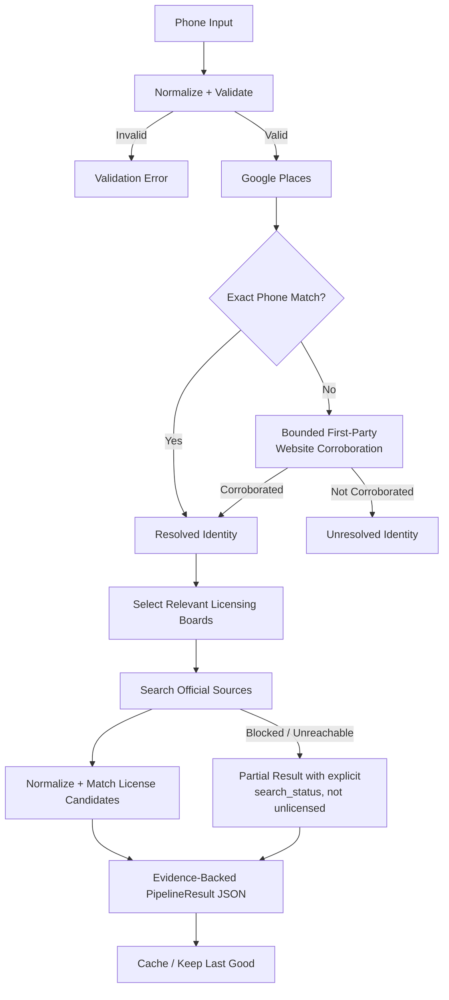

# HireNimbus License Discovery Agent

This project turns a messy U.S. business phone number into an evidence-backed,
structured result containing a resolved business identity when supported,
relevant contractor and trade-license searches, provenance, confidence, board
search statuses, conflicts, and explicit incomplete-result handling.

In a marketplace recommendation workflow, attaching the wrong identity or
license is worse than returning an incomplete result. The pipeline therefore
favors strong evidence over guessing.

The goal is trustworthy phone -> identity -> license discovery, not guaranteed
discovery for every input. Missing values remain `null`, candidates are not
automatically treated as licenses, and an unreachable board remains visibly
different from a successful search that returned no candidate rows.

## Setup

Python 3.12 or newer is required. Runtime dependencies are `httpx`,
`phonenumbers`, `pydantic`, and `python-dotenv`; the development extra installs
`pytest`.

```bash
python3.12 -m venv .venv
source .venv/bin/activate
python -m pip install -e '.[dev]'
cp .env.example .env
```

Enable **Places API (New)** for the Google Cloud project associated with the
key, then edit `.env` without committing the real value:

```dotenv
GOOGLE_PLACES_API_KEY=replace-with-a-restricted-google-places-api-key
```

The application loads `.env` from the current working directory without
overriding an already exported variable. `.env` and the runtime `.cache`
directory are ignored by Git. `GOOGLE_PLACES_API_KEY` is required for live
identity discovery. `HIRENIMBUS_CACHE_PATH` is optional and overrides the
default `.cache/license_results.json` Day 3 cache path.

## Day 1 CLI

The installed CLI accepts a phone in any supported U.S. representation:

```text
lookup_identity <phone>
```

For example:

```bash
lookup_identity "(512) 943-7070"
```

It writes an `IdentityLookupResult` JSON document containing `found`,
qualitative `confidence`, normalized `input_phone`, `identity`, source
`evidence`, candidate `assessments`, `notes`, and `error`. Exit codes are `0`
for a completed lookup, including a legitimate no-result; `1` for
configuration/provider failure; and `2` for invalid input.

## Day 3 tool interface

`find_licenses` is the thin tool-style public interface for the complete phone
-> identity -> license pipeline:

```python
from app import find_licenses

result = find_licenses("(512) 943-7070")
print(result.model_dump_json(indent=2))
```

Pass `refresh=True` to force a new provider and board attempt:

```python
result = find_licenses("(512) 943-7070", refresh=True)
```

This repository does not expose an HTTP server or a full MCP server. The Python
function is the brief's simple tool-style interface and returns a typed
`PipelineResult` that can be serialized directly to JSON.

## Architecture and flow



The stages deliberately preserve the distinction between observed provider
facts, matching inferences, accepted claims, conflicts, and source failures.

## Day 1 design decisions

- Phones are parsed as U.S. numbers and normalized to E.164
  (`+1XXXXXXXXXX`). Extensions are preserved separately. Invalid, implausible,
  and supplied reserved `555-01xx` controls are rejected before provider calls.
- Places API (New) Text Search first receives the compact E.164 phone. Only
  when that request returns zero candidate Place IDs does the client retry once
  with a spaced country code, such as `+1 7034779016`. Place IDs are
  deduplicated before Place Details retrieval.
- Place Details is the primary Google verification signal. A single
  candidate whose returned phone normalizes exactly to the input is preferred.
  Search order is never treated as identity proof; multiple exact candidates
  or conflicting returned phones remain unresolved.
- The Google display name is stored as `business_name`, not promoted to
  `legal_name` or `dba`. Raw Google types remain available alongside
  conservatively normalized trade categories.
- Closed, moved, and pure service-area listings retain those facts. Hidden
  service-area addresses remain missing rather than being inferred.

### Bounded first-party website corroboration

Website corroboration is considered only when Places returned one or more
candidates but none passed exact Places-phone verification. For each eligible
candidate, the resolver may fetch only the `websiteUri` returned by Place
Details; it does not search the web or crawl linked pages.

A website candidate qualifies only when the single bounded first-party page
contains all three of the following:

1. the exact normalized input phone;
2. the same normalized Places business identity; and
3. the exact normalized full Places street address.

Exactly one Places candidate must satisfy the complete rule. An accepted
website-correlated identity remains `medium` confidence. The original phone
returned by Places, its mismatch assessment, the website phone, Google
Maps/Places evidence, and the first-party evidence URL remain visible.

Website retrieval accepts only public HTTP(S), blocks known third-party
directory/social domains and non-public network destinations, bounds timeout,
response size, and redirect count, and rejects cross-first-party redirects and
HTTPS downgrades. Fetch failure preserves the conservative unresolved result
rather than failing the whole pipeline.

There is no generic web crawler, third-party directory fallback, general web
search, or state-corporation-registry integration.

## Day 2 design decisions

Board selection uses only the resolved identity's observed state and normalized
trade categories. An observed jurisdiction makes a source relevant to search;
it is not evidence that a license exists.

Coverage follows `data/boards.md` where an official source is safely
accessible:

- Texas plumbing routes to TSBPE; Texas electrical/HVAC routes to TDLR.
- Virginia routes to DPOR's 2705 contractor and 2710 tradesman lists.
- California routes to the CSLB License Master download flow.
- Maryland electrical and MHIC mappings are represented, but unsafe,
  inaccessible, or CAPTCHA-dependent query paths are skipped or reported rather
  than bypassed.
- District of Columbia remains an explicit ambiguous/skipped result because
  the supplied guidance does not establish a safe category-specific adapter.

Official bulk downloads and open data are preferred to brittle HTML scraping.
CAPTCHAs, Cloudflare/WAF challenges, and other bot protections are never
bypassed.

Generated search keys retain provenance from established `legal_name`, `dba`,
`business_name`, and `owner_principal` fields. Name comparison normalizes case,
punctuation, whitespace, and common legal suffixes. Partial and fuzzy
relationships are retained in auditable decisions but are not accepted on that
evidence alone. Person/owner matches require exact phone or address
corroboration.

Every returned board row first becomes a `CandidateLicenseRecord`; it is not an
accepted license until the separate identity-matching policy succeeds. The
narrow phone-conflict override applies only when an established business name
matches exactly and at least one official business or mailing address exactly
matches the full Day 1 address. The different board contact phone remains in
the candidate, conflict list, and explanatory match notes.

Active and inactive records are both eligible for matching when the official
source exposes them. The raw status string is preserved alongside a normalized
`active` or `inactive` value when an explicit status can be mapped. Missing or
unknown standing remains `null`; expiration dates are never used to invent a
status.

## Board search statuses

Every selected or skipped board produces one of these statuses:

| Status | Meaning |
| --- | --- |
| `ok` | The official source was reached and returned candidate rows. Candidates may still fail identity matching. |
| `not_found` | The source was reached successfully but returned no candidate rows for the generated search keys. |
| `unreachable` | HTTP, download, schema, decoding, or parsing behavior prevented a trustworthy search. |
| `captcha_blocked` | The official source required human CAPTCHA interaction, so automation stopped. |
| `skipped` | No safe adapter or sufficiently specific board mapping was available. |

`not_found` never means "this business is unlicensed." It means only that the
particular reachable source and query produced no candidate rows. Name forms,
owner-held licenses, different boards, source coverage, and licensing
exemptions can all produce an honest no-result.

## Caching and idempotency

The durable Day 3 cache is keyed by the normalized base phone, so formatting
variants share one entry. Complete pipeline results may be cached; partial and
failed results are not allowed to replace a previous last-good entry.

A normal call returns the cached complete result when available and reports
`cache.status="hit"` for that invocation. `refresh=True` always makes a fresh
attempt. A complete refresh replaces the cached result. A partial or failed
refresh returns the current attempt, explicitly reports that the prior
last-good result was preserved, and leaves that cached value unchanged.

Board-source access also uses a small process-local successful-result cache and
polite request spacing. It is separate from the normalized-phone Day 3 cache.

## Evaluation methodology and results

`data/phones.csv` contains 28 rows. Twenty-two rows are valid phone inputs; once
formatting variants are normalized and deduplicated, they represent 17 unique
valid phones. The primary identity-coverage denominator is those 17 unique
phones, so duplicate formatting rows do not inflate the result.

Control rows P20-P25 are reported separately from the primary unique-phone
metrics and all fail input validation: P20-P22 use the reserved fictional
555-01xx range, while P23-P25 are otherwise invalid or implausible U.S.
numbers. Manual ground truth is evaluation-only and is never read by production
matching. Unknown identity ground truth is not automatically counted as
incorrect. Accepted-license precision is judged only
where sufficient official verification exists, and the recall denominator
contains only manually verified relevant licenses.

Evaluation results:

| Metric | Result |
| --- | --- |
| Identity coverage | **10/17 unique valid phones (58.8%)** |
| Identity accuracy | **8/8 judgeable identity predictions (100%)** |
| License precision | **1/1 judgeable accepted licenses (100%)** |
| License recall | **1/8 verified reference licenses (12.5%)** |

License recall is limited mainly by inaccessible official sources, historical
records missing from current bulk downloads, and business-to-license
relationships that could not be proven from runtime evidence without making
assumptions.

Public Places and board data change over time. The checked-in evaluation report
records the observed source behavior and timestamps for this run.

## Example outputs

The `examples/` directory contains three direct, unedited
`PipelineResult.model_dump_json(indent=2)` serializations produced by the
actual pipeline:

- `examples/p09_fox_service_company.json` - Fox Service Company identity was
  resolved and TDLR `33423` was accepted. The overall result remains `partial`
  because another relevant board was unreachable.
- `examples/p16_roto_rooter_partial.json` - identity was resolved through the
  bounded first-party website corroboration rule; the downstream CSLB search
  was `unreachable`.
- `examples/p23_invalid_phone.json` - demonstrates invalid-input rejection,
  failure status, and the absence of board searches.

The files retain nulls, evidence URLs, timestamps, conflicts, notes, cache
metadata, and board `search_status` values. They were not hand-edited.

## Failure modes and trade-offs

The system prefers precision over speculative recall. Common limitations are:

- **Alternate, tracking, or location-specific phones:** a public number may
  differ from a Places or board contact number.
- **Limited Places data:** some phones return no candidate, and service-area
  businesses may not publish a street address.
- **Different names and holders:** a board may use a DBA, legal name, parent
  company, or individual owner's name instead of the public business name.
- **Multi-location and multi-state businesses:** one listing may not establish
  every location, jurisdiction, or corporate relationship.
- **Board access and coverage:** outages, CAPTCHA/WAF restrictions, and
  current-only datasets can leave a search incomplete.
- **Source and licensing differences:** schemas and endpoints change, and
  licensing requirements vary by trade and jurisdiction.

## With more time

The following are future work, not current capabilities:

- broader first-party and state-registry identity discovery for phones with no
  Places candidates;
- stronger legal-name, DBA, parent-entity, and owner/principal resolution;
- resilient access to additional official bulk datasets where legitimately
  available, without bypassing access controls;
- malformed-row-tolerant DPOR parsing with explicit incomplete-source
  diagnostics;
- canonical board-specific license-number formatting;
- richer multi-state and multi-location relationship reasoning; and
- a broader manually verified evaluation set.

## AI assistance and human decisions

AI coding assistants were used for implementation support, test generation,
debugging, and design/audit suggestions. I reviewed the resulting behavior and
made the final decisions on conservative identity verification, the
exact-phone-first policy, bounded first-party website corroboration, evidence
thresholds, board routing, license acceptance rules, conflict handling and
preservation, caching semantics, evaluation methodology, and which suggested
changes to reject because they weakened provenance or required unsupported
inference.

Manual evaluation findings remain separate from production behavior. No
case-specific evaluation labels, manually verified business aliases, or
verified license numbers are hardcoded into runtime matching.

## Tests

Run the complete suite with:

```bash
pytest
```

Current test result: **177 passed**.

The suite includes unit and integration coverage for phone parsing, Places
request behavior, website security bounds and corroboration, category mapping,
board selection, search-key and name normalization, source adapters, candidate
roles, license matching and conflict evidence, status mapping, pipeline/cache
semantics, evaluation calculations, CLI behavior, and checked-in fixtures.
Mocks and fixtures are used where appropriate; the 177 tests are not 177 live
API calls, and the normal suite does not require live Google or board access.
