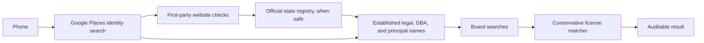

# HireNimbus License Discovery Agent

Given a U.S. business phone number, this project looks for a business identity
and relevant contractor or trade licenses. It records the evidence and source
limitations behind each result so a reviewer can see why a candidate was
accepted, rejected, or left unresolved.

The operating rule is: **acquire broadly, accept conservatively**.

## What the pipeline does



1. Normalize and validate the phone, then query Google Places for candidate
   business identities.

2. Check the first-party website for supporting evidence such as phone, name,
   address, legal name, and published license numbers. The crawl is limited to
   eight same-domain pages.

3. Query the relevant official state business registry where a safe public path
   exists.

4. If a registry entity can be confidently linked to the business, add its
   legal name, current DBA/trade names, and qualifying principals as additional
   board-search names.

5. Search the relevant official licensing boards.

6. Treat board results as candidates. The final matcher checks identity,
   jurisdiction, trade compatibility, supporting evidence, and contradictions
   before accepting a license.

Registry evidence keeps its source, entity ID, original name, and role.

Fuzzy similarity alone cannot establish an entity or accept a license. Partial
or fuzzy board-name matches remain near-matches unless stronger evidence
supports them.

A blocked or empty government-source query is reported as incomplete or
not found for that query. It is not treated as proof that a business has no
license.

## Setup

Python 3.12 or newer is required.

```bash
python -m venv .venv
source .venv/bin/activate
python -m pip install -e '.[dev]'
cp .env.example .env
```

Enable Google Places API (New) in Google Cloud and add a restricted key to
`.env`:

```dotenv
GOOGLE_PLACES_API_KEY=your-restricted-api-key
```

`.env` and runtime caches are ignored by Git.

You can set `HIRENIMBUS_CACHE_PATH` to change the default cache path:

```text
.cache/license_results.json
```

## Run it

Resolve the identity only:

```bash
lookup_identity "(512) 943-7070"
```

Run the full pipeline from Python:

```python
from app import find_licenses

result = find_licenses("(512) 943-7070")
print(result.model_dump_json(indent=2))
```

`find_licenses(phone, refresh=True)` makes a fresh attempt and returns that
attempt for review.

A partial or failed refresh does not replace a previously stored complete
Phase 2 result.

### Cache keys

Without a market hint, Phase 2 uses:

```text
phase2:<normalized E.164 phone>
```

With a market hint:

```text
phase2:expanded:<normalized E.164 phone>:<trimmed, case-folded market hint>
```

The market hint helps choose likely jurisdictions. It does not establish
business identity or license ownership.

## Registry evidence and conservative matching

Once a registry entity is confidently linked to the business, it can add
three kinds of names to board search:

- the registry's legal name;
- a current official DBA, trade name, or fictitious name;
- a person explicitly identified by the registry as a qualifying principal.

The original Google Places name remains separately labeled.

Registered agents, organizers, signers, and service agents are not treated as
principal search keys.

Multiple unresolved registry candidates remain ambiguous.

Exact normalized names and qualifying official aliases may establish an
entity. Fuzzy similarity alone, a registered-agent address, or a shared city
does not.

Final license matching also checks jurisdiction, trade compatibility, identity
evidence, and material conflicts.

The existing `0.88` fuzzy threshold is retained for near-match reporting.
Fuzzy similarity by itself never accepts a license.

A narrow exact-number path is also supported when a verified first-party
business website publishes a license number and the official board
independently returns the same canonical number.

Different-name individual or master-license records still require an
established principal relationship or another existing person-specific rule.

## State-source limits

| State / source | What the current integration can do | Main limit |
|---|---|---|
| Virginia SCC and DPOR | Parse legitimately available SCC detail records and search official DPOR regulant lists. | SCC live name search requires reCAPTCHA and stops there. Detail parsing is not a general manual-ID importer. DPOR downloads may also be malformed or unavailable. See [Virginia evidence workflow](docs/virginia_manual_registry_evidence.md). |
| Maryland SDAT and Labor boards | Carry registry-derived search names into the Maryland board-search flow and preserve them in audit output. | SDAT is protected by Turnstile. Electrician and MHIC forms require human verification. The implementation checks the official form, records the search names, and stops without submitting them or bypassing CAPTCHA. See [Maryland evidence workflow](docs/maryland_manual_registry_evidence.md). |
| District of Columbia DLCP and Industrial Trades | Join official corporate, trade-name, and beneficial-owner records by file number and search supported plumbing, electrical, and HVAC/refrigeration license categories. | Other DC categories are unsupported. Beneficial-owner data is last-reported and does not prove the relationship is still current. |
| California SOS and CSLB | Check ordinary public SOS access, accept explicit manual evidence, and use official CSLB public license data for board candidates. | No documented unauthenticated automated SOS name-search API was available. County fictitious-business-name filings are out of scope. CSLB's free public data does not cover every historical or inactive record. |
| Texas TDLR and TSBPE | Continue using the existing official board integrations, including bounded exact-number retrieval where supported. | No Texas business-registry enrichment was added. TSBPE downloads can return HTTP 403. Texas licenses remain part of the expanded evaluation set. |

No integration bypasses CAPTCHA, Turnstile, WAF, authentication, or other
access controls.

Google Places provider lookups completed without provider errors for all
22 valid rows in the current run. That does **not** mean all 22 business
identities were successfully resolved. Identity resolution still requires
supporting evidence.

## Evaluation

The expanded evaluation covers all **17 unique valid phone cases** and uses a
frozen set of **23 manually reviewed licenses**.

The original evaluation contained 8 licenses and remains preserved separately
as the historical baseline.

### Current result

- **11 / 23 licenses recovered (47.8% recall)**
- **11 verified correct license predictions**
- **0 verified incorrect license predictions**
- **1 additional prediction remains unverified**

The extra prediction, `DC_INDUSTRIAL_TRADES:ECC40000316`, is outside the
frozen reference set and does not have enough retained evidence to classify
as correct or incorrect.

The expanded set contains **10 Texas licenses** and **13 licenses from
Maryland, DC, Virginia, and California**. Texas registry enrichment was out of
scope, but Texas board licenses remain in the evaluation.

Primary-source evidence is retained in the repository for **16 of the 23**
references. Seven could not be independently reproduced during the final audit
because of current source-access limitations or missing retained relationship
evidence. They remain in the frozen set so the evaluation is not changed after
the fact.

Reference set:

[`data/evaluation_ground_truth_expanded.json`](data/evaluation_ground_truth_expanded.json)

Evidence audit:

[`evaluation/expanded_ground_truth_sources.md`](evaluation/expanded_ground_truth_sources.md)

Current report:

[`evaluation/expanded_evaluation_report.json`](evaluation/expanded_evaluation_report.json)

Registry-name attribution in the current result:

- **2 legal-name recoveries**
- **0 DBA/trade-name recoveries**
- **0 principal-name recoveries**

### Historical baseline

The original Phase 1 and initial Phase 2 reports both remain **1 / 8** and are
preserved separately from the expanded evaluation.

- [Phase 1 report](evaluation/day3_evaluation_report.json)
- [Initial Phase 2 report](evaluation/phase2_evaluation_report.json)
- [Initial Phase 2 audit](evaluation/phase2_evaluation_audit.md)

An earlier source-blocked expanded attempt is also retained at
[`evaluation/expanded_evaluation_report.source_blocked.20261002T232127Z.json`](evaluation/expanded_evaluation_report.source_blocked.20261002T232127Z.json)
and is marked non-comparable.

### Running the expanded evaluation

Use a fresh cache and write the result outside the historical report paths:

```bash
eval_dir="$(mktemp -d "${TMPDIR:-/tmp}/hirenimbus-expanded.XXXXXX")"

PYTHONPATH=src python scripts/evaluate.py \
  --ground-truth data/evaluation_ground_truth_expanded.json \
  --cache-path "$eval_dir/cache.json" \
  --output "$eval_dir/report.json"
```

This performs live provider, registry, and board lookups. Blocked or
unavailable government sources remain incomplete rather than being treated as
confirmed negatives.

## Examples and tests

The four deterministic registry-flow examples demonstrate registry evidence
moving through entity establishment, expanded search names, board selection,
and license matching:

- [Virginia example](examples/deterministic_registry_flow_va.json) and
  [test](tests/test_va_integration.py)
- [Maryland example](examples/deterministic_registry_flow_md.json) and
  [test](tests/test_md_integration.py)
- [DC example](examples/deterministic_registry_flow_dc.json) and
  [test](tests/test_dc_integration.py)
- [California example](examples/deterministic_registry_flow_ca.json) and
  [test](tests/test_ca_integration.py)

These examples use synthetic or injected evidence and are labeled as such.
They are not counted as live evaluation results.

The Maryland example intentionally ends at the official human-verification
gate rather than bypassing it.

Dated live case audits are also retained for:

- [Virginia](examples/phase2_va_brownlee_audit.json)
- [Maryland](examples/phase2_md_powerworks_audit.json)
- [DC](examples/phase2_dc_wl_gary_audit.json)
- [California](examples/phase2_ca_roto_rooter_audit.json)

These files represent observations from those specific runs and are not the
current benchmark.

The test suite covers phone validation, Places and website evidence, registry
parsing and establishment, search-name provenance, board routing, source
status, exact and near-match behavior, cache behavior, and evaluation metrics.

The latest verified run had **350 passing tests**:

```bash
python -m compileall -q src/app scripts tests
python -m pytest
git diff --check
```

## Trade-offs

The implementation prioritizes reliable official evidence and conservative
license acceptance over maximizing recall.
CAPTCHA, Turnstile, WAF restrictions, incomplete government datasets, and
ambiguous multi-location identities therefore remain explicit partial results
rather than being bypassed or guessed through.
This keeps false-positive risk low while making source-access failures and
remaining recall gaps visible.

## AI assistance

AI tools assisted with implementation, test drafting, documentation drafting,
and mechanical audits. I reviewed the changes and remain responsible for the engineering decisions
and acceptance rules. Synthetic or fixture-driven examples are not presented as live evidence, and
AI-generated text is not treated as a substitute for an official source.
